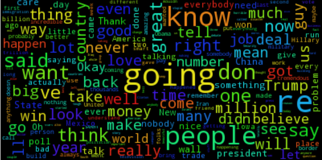

# trump-speeches

## What is it?
1mb of text data taken from speeches made by Donald Trump at various points in his 2016 campaign for President of the United States.

## What is this for?
For all of your data science, machine learning, and entertainment needs.



## Examples
Run the example Word Cloud generator.

```bash
pip install wordcloud
cd examples
python trump_wordcloud.py
```

## License
Copyright Disclaimer Under Section 107 of the Copyright Act 1976, allowance is made for "fair use" for purposes such as criticism, comment, news reporting, teaching, scholarship, and research. Fair use is a use permitted by copyright statute that might otherwise be infringing. Non-profit, educational or personal use tips the balance in favor of fair use
